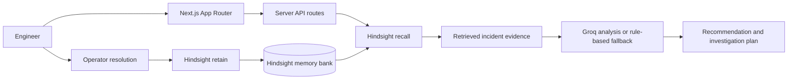

# IncidentIQ

**Your production incidents should teach your next incident.**

IncidentIQ is an incident response intelligence workspace. It searches previous incident outcomes before recommending a response, shows the records that support its reasoning, and retains operator-authored resolutions for future recall. Hindsight is the persistent memory layer when configured; local synthetic records are clearly labeled demo memory and are never represented as live Hindsight results.

## Problem

Production responders often repeat the same investigation because root causes, failed mitigations, and successful resolutions are scattered across chat, tickets, and individual memory. Generic incident checklists do not carry a team's operational context into the next event.

## Solution

IncidentIQ connects a new incident to relevant historical evidence, presents a cautious investigation plan, and captures the resolution as a structured memory. The analyst can inspect each returned memory and the recommendation explains how that record informs the next step.

## Why Hindsight

Hindsight is the persistent, semantic memory system for resolved incident records. IncidentIQ uses the official `@vectorize-io/hindsight-client` package and its supported `retain`, `recall`, `reflect`, and version-check APIs. Hindsight calls are centralized in `lib/hindsight`; credentials stay on the server. Recall results are displayed as returned, and no historical incident is invented to fill an empty result.

## Architecture



Memory loop: **retain → recall → analyze → resolve → retain**.

The incident UI includes an analysis route, incident history, Hindsight memory explorer, learning timeline, and integration status. API routes validate inputs with Zod. Groq output is parsed against a schema; malformed responses and unavailable credentials fall back to a rule-based analysis that cites only supplied retrieved records.

## Tech stack

- Next.js App Router, React, and TypeScript
- Tailwind CSS 4 with focused application styles
- Hindsight TypeScript client (`@vectorize-io/hindsight-client`)
- Groq SDK (`groq-sdk`) for optional structured incident analysis
- Zod input and model-response validation
- Lucide icons and Vitest

## How Hindsight is used

- **Recall:** incident title, service, error code, symptoms, and recent changes are sent to Hindsight before analysis.
- **Retain:** resolved incident details, root cause, applied response, what worked, what failed, impact, lesson, related incident ID, tags, metadata, and a stable document ID are retained.
- **Reflect:** supported and verified by the client service boundary for future evidence synthesis; current analysis uses retrieved source records plus Groq/rule-based structured analysis so recommendations can be traced to displayed evidence.
- **Health:** the server checks `getVersion()` before reporting Hindsight connected.
- **Seed:** `Load demo memories` checks for existing `incidentiq-demo` tagged records before retaining synthetic seed incidents.

The TypeScript client API was verified against the published `@vectorize-io/hindsight-client` 0.10.1 README and installed declarations. It supports `apiKey` Bearer authentication, `documentId`, metadata, tags, `retain`, `recall`, `reflect`, and `getVersion`.

## Screenshots

Screenshots can be added here after running the app:

- Dashboard
- Incident analysis with returned memory
- Memory explorer
- Learning timeline

## Local setup

Requirements: Node.js 20.9+ (Next.js 16 requirement) and npm.

```powershell
cd incidentiq
Copy-Item .env.example .env.local
npm install
npm run dev
```

Open [http://localhost:3000](http://localhost:3000). The app starts without API keys in demo mode. The top banner and memory cards label synthetic local records as **Demo Memory**. Local resolution learning is stored only in this browser's local storage until Hindsight is configured.

## Environment variables

| Variable | Purpose |
| --- | --- |
| `HINDSIGHT_API_KEY` | Optional Hindsight Bearer API key; required only if the Hindsight server enforces key auth. |
| `HINDSIGHT_BASE_URL` | Hindsight API base URL, for example `http://localhost:8888`. |
| `HINDSIGHT_BANK_ID` | Persistent memory bank ID, for example `incidentiq`. |
| `GROQ_API_KEY` | Optional server-only Groq key for structured incident analysis. |
| `NEXT_PUBLIC_APP_URL` | App's public URL, used for deployment configuration. No secret belongs in a `NEXT_PUBLIC_` variable. |

Never commit `.env.local`. The repository ignores `.env*` files except `.env.example`.

## Run and validate

```powershell
npm run dev
npm run typecheck
npm run lint
npm test
npm run build
```

## Load demo memories

Configure and verify Hindsight first, then open **Memory** or **System status** and select **Load demo memories**. The seed is synthetic and duplicate-aware. Without a live Hindsight connection, this action is disabled; built-in synthetic records remain available and labeled as Demo Memory.

## Test the memory loop

1. Open **New incident** and submit the prefilled Payments API 503 scenario.
2. Review the source badge and returned memory cards on **Incident analysis**. In demo mode, cards explicitly say **Demo Memory**; with Hindsight connected, they say **Hindsight**.
3. Compare the detected pattern and response guidance with the displayed source record. Empty recall results produce generic guidance and no supporting incident IDs.
4. Resolve the incident and submit the root cause, mitigation, impact, and lesson. With a live connection the API retains it to Hindsight; without one it is labeled and saved as browser-only demo learning.
5. Submit a similar incident and inspect whether the newly retained record is returned by Hindsight. In demo mode, the same browser's local demo record can be matched, but that is not a persistent Hindsight test.

## 60-second demo path

1. Start at the dashboard and point out the demo/connection status.
2. Open **New incident** with the Payments API 503 example.
3. Run analysis; show the memory source and INC-102 record.
4. Explain why the connection-pool result changes the investigation order.
5. Resolve the incident and retain the outcome (or explicitly show browser-only demo mode).
6. Run a similar incident again to demonstrate recall. Only call this a Hindsight memory loop when the status endpoint verifies a real Hindsight connection.

## Deployment

The app uses server routes and is compatible with standard Next.js hosting, including Vercel. Configure Hindsight and Groq secrets in the host's server environment settings. The Hindsight endpoint must be reachable from the deployment runtime. Confirm the status page reports Hindsight connected after deployment; no deployment has been performed by this repository setup.

## Limitations

- No authentication or multi-tenant access control is included; do not expose this demo to an untrusted network with incident data.
- Demo incidents and telemetry are synthetic. Browser demo learning is not durable across browsers or cleared site data.
- Hindsight and Groq connectivity depends on external service availability and credentials. A configured key alone is not shown as proof of service connectivity.
- LLM recommendations are operational guidance, not automated remediation; responders must validate telemetry and rollback plans.
- Memory counts in demo mode describe sample records, not a live Hindsight bank.

## Future improvements

- Add SSO, role-based access, audit events, and tenant-isolated Hindsight banks.
- Add integration adapters for alert sources, issue trackers, and deployment metadata.
- Add durable incident records and retention policies for production use.
- Add evaluation datasets for retrieval relevance and recommendation quality.
- Use Hindsight reflect with a versioned response schema as an evidence synthesis option, with explicit source attribution.